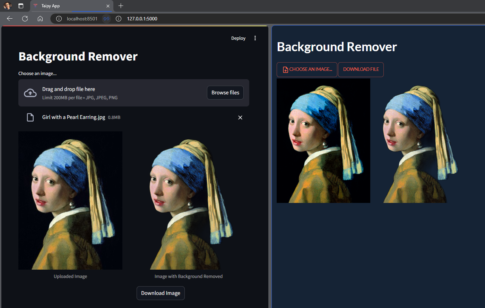
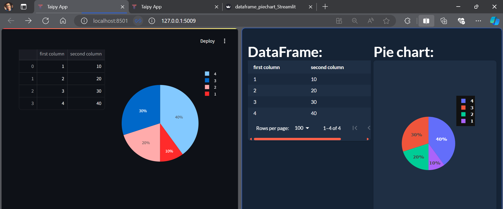
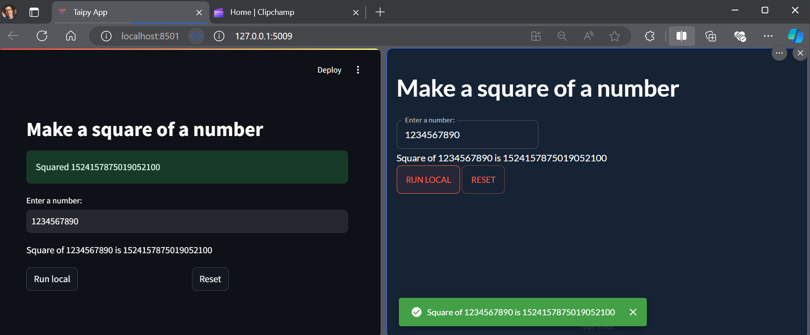

A comprehensive comparison and tutorial repository exploring popular Python web application frameworks and UI libraries.

# Background Remover
Streamlit offers a straightforward approach to creating a background remover application with its intuitive file uploader and image display components. It provides a clean, columnar layout and a built-in download button for easy user interaction. Taipy, while requiring more setup code, offers greater control over the UI layout and file handling process. It uses a custom file selector and provides more detailed notifications about the processing and saving of images. While Streamlit excels in rapid prototyping and ease of use, Taipy provides more flexibility for complex interactions and custom UI designs.

## Code:
- Streamlit: [background_remover - Streamlit](./background_remover_Streamlit.py)
- Taipy: [background_remover - Taipy](./background_remover_Taipy.py)

# Slider
Streamlit allows for quick and easy slider creation with minimal code but tends to be slower in performance. Taipy requires more code but offers JavaScript-level speed and efficiency. Overall, Streamlit is ideal for rapid prototyping, while Taipy is better suited for performance-focused applications.

## Code:
- Streamlit: [slider - Streamlit](./slider%20-%20Streamlit.py)
- Taipy: [slider - Taipy](./slider%20-%20Taipy.py)

# DataFrame and Pie Chart
Streamlit simplifies the creation of DataFrames and pie charts with minimal code using its built-in components and Plotly for visualization, offering an interactive user experience. Taipy, on the other hand, uses a markdown-like syntax for layout, with built-in chart support, allowing for more control over design and performance. While Streamlit is perfect for quick visualizations and rapid development, Taipy excels in creating more customized and performant applications.

## Code:
- Streamlit: [dataframe_piechart - Streamlit](./dataframe_piechart_Streamlit.py)
- Taipy: [dataframe_piechart - Taipy](./dataframe_piechart_Taipy.py)

# Handling Notifications
When it comes to user notifications, Streamlit provides built-in, easy-to-use methods like st.success() and st.warning(), making it quick to notify users of successful operations or resets. You can even add playful elements like balloons for a more engaging experience. Taipy, on the other hand, offers more control through the state.notify() function, allowing for custom notification types such as 'success' or 'warning'. While Streamlit is great for apps that need simple and fast notifications, Taipy is more suitable for projects where advanced interaction and custom notifications are required.

## Code:
- Streamlit: [handling_notifications - Streamlit](./notify_Streamlit.py)
- Taipy: [handling_notifications - Taipy](./notify_Taipy.py)